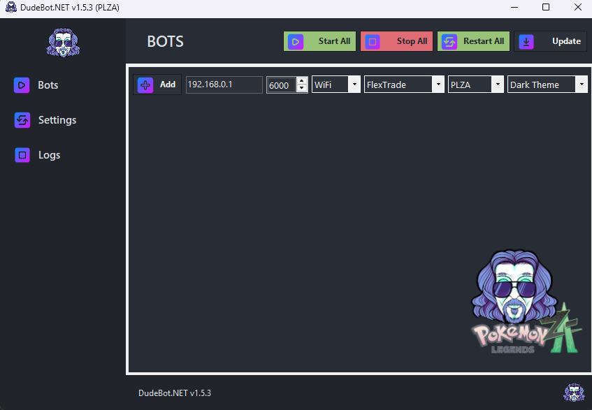
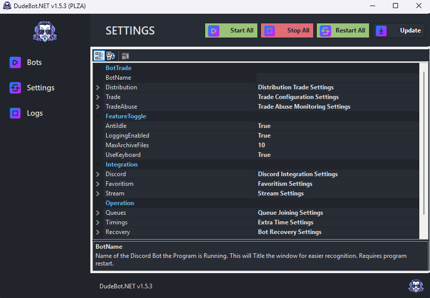
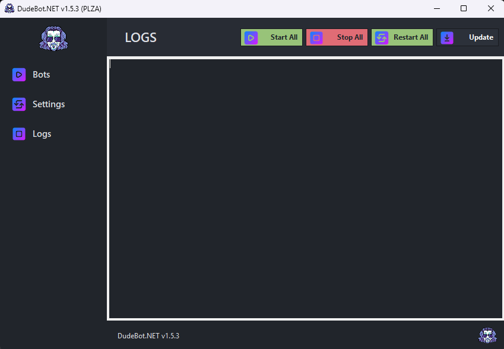

# 🤖 DudeBot.NET

**DudeBot.NET** is a high-performance, feature-rich fork of SysBot.NET, designed for advanced remote control automation of Nintendo Switch Pokémon games. Powered by [sys-botbase](https://github.com/olliz0r/sys-botbase), it provides a robust framework for automated distribution, encounter hunting, and collection management.

---

## 📑 Table of Contents
- [🌟 Key Features](#-key-features)
- [📸 Screenshots](#-screenshots)
- [🏗️ Project Structure](#️-project-structure)
- [📦 Dependencies](#-dependencies)
- [🤝 Support](#-support)
- [📜 License](#-license)

---

## 🌟 Key Features

### 🎮 Multi-Game Support
Automated trading and encounter bots for all modern Nintendo Switch Pokémon titles:
- **Pokémon Legends: Z-A (PLZA)**: Full support for the latest generation.
- **Pokémon Scarlet & Violet (SV)**: Including Tera Type handling and Scale information.
- **Pokémon Legends: Arceus (LA)**: Specialized support for Alpha Pokémon and research tasks.
- **Pokémon Brilliant Diamond & Shining Pearl (BDSP)**: High-performance trade logic using modernized async operations.
- **Pokémon Sword & Shield (SWSH)**: Comprehensive support for all distribution types.
- **Pokémon Let's Go, Pikachu! & Eevee! (LGPE)**: Legacy support for Kanto-based distributions.

### 🤖 Automation & Intelligence
- **Auto-Legality Mod (ALM)**: Integrated on-the-fly legalization ensures all distributed Pokémon meet strict legality standards.
- **High-Performance Logic**: BDSP trade routines refactored with `Span<byte>` and `MemoryMarshal` for maximum speed and zero-allocation memory management.
- **Async Modernization**: Fully non-blocking batch trade sequences using `Task`-based operations.
- **AutoOT Integration**: Personalize Pokémon with the receiver's trainer information automatically.

### 📊 Enhanced Discord Experience
- **Visual Embeds**: Multi-column layouts for clean and professional data visualization.
- **Advanced Metadata**: 
  - **Hyper Trained (HT)** indicators for IVs.
  - **Origin & Physical**: Clear display of Met Level, Met Date, and Met Location (with ID).
  - **Scale Visualization**: See exactly how big or small your Pokémon is.
- **Refined Nature Logic**: Detailed display for minted natures, showing both intended stats and visual nature (e.g., `Adamant (Minted from: Jolly)`).
- **Special Symbols**: Professional iconography for Shiny, Alpha, Marks, and Ribbons.

---

## 📸 Screenshots

View Application Previews

### Bots Dashboard

### Settings Configuration

### Real-time Logs

---

## 🏗️ Project Structure

| Component | Description |
| :--- | :--- |
| **SysBot.Base** | Core logic library containing synchronous and asynchronous bot connection classes. |
| **SysBot.Pokemon** | Game-specific logic for Pokémon Sword/Shield and subsequent Switch titles. |
| **SysBot.Pokemon.WinForms** | User-friendly GUI launcher for managing and configuring Pokémon bots. |
| **SysBot.Pokemon.Discord** | Comprehensive Discord interface for remote interaction and queue management. |
| **SysBot.Pokemon.ConsoleApp** | Lightweight console interface for headless bot operations. |
| **SysBot.Tests** | Extensive unit test suite (50+) ensuring logic stability and correctness. |

---

## 📦 Dependencies

DudeBot.NET leverages several powerful open-source libraries:
- **Core Engine**: Powered by a custom fork of [PKHeX.Core](https://github.com/kwsch/PKHeX/) by [@hexbyt3](https://github.com/hexbyt3/PKHeXth).
- **Automation**: [sys-botbase](https://github.com/olliz0r/sys-botbase) for console communication.
- **Legality**: Integrated [Auto-Legality Mod](https://github.com/architdate/PKHeX-Plugins/) (using [@santacrab2](https://github.com/santacrab2)'s fork).
- **Integrations**: [Discord.Net](https://github.com/discord-net/Discord.Net), [TwitchLib](https://github.com/TwitchLib/TwitchLib), and [StreamingClientLibrary](https://github.com/SaviorXTanren/StreamingClientLibrary).

---

## 🤝 Support

Need help setting up your instance?
- 📖 **Read the Docs**: Check the [Wiki](https://github.com/NexusRisen/DudeBot.NET/wiki) for detailed guides.

> **Note**: This bot is a fork of SysBot.NET. Please do not contact the PKHeX Development Project for support regarding DudeBot.NET.

---

## 📜 License
DudeBot.NET is licensed under the **AGPLv3**. See [LICENSE](LICENSE) for more details.
